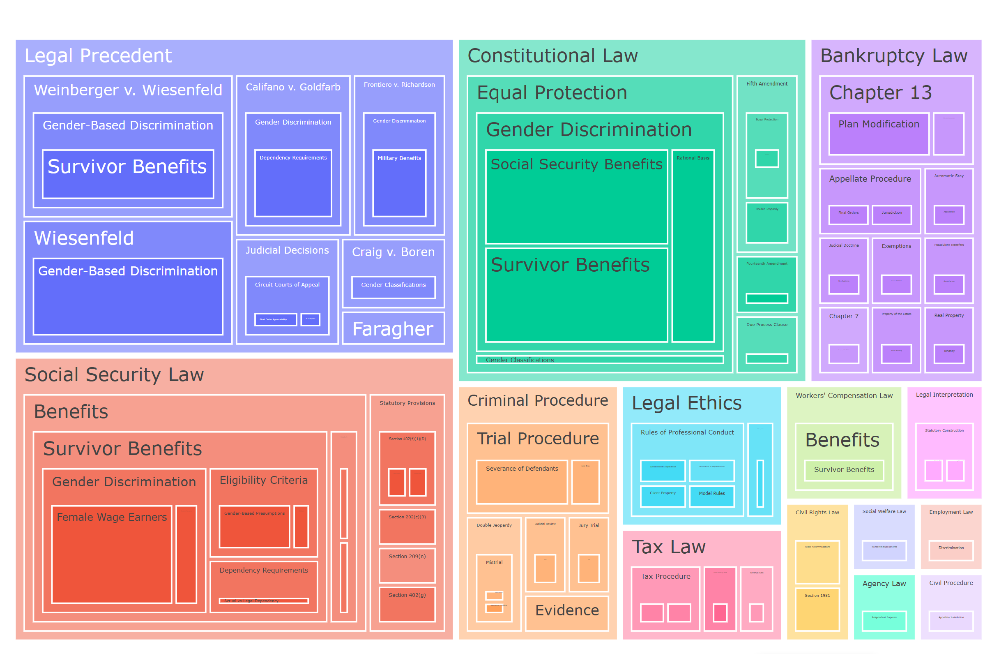

# KAG: Knowledge Augmented Generation



> The goal of KAG is to build a knowledge-enhanced LLM service framework in professional domains, supporting logical reasoning, factual Q&A, etc. KAG fully integrates the logical and factual characteristics of the KGs.

**Contents**
- [1. Overview](#1-overview)
- [2. Key Features](#2-key-features)
- [3. Advantages](#3-advantages)
- [4. Dataset](#4-dataset)
- [5. Quick Start](#5-quick-start)
- [6. Roadmap / ToDo](#6-roadmap--todo)
- [7. Contribution](#7-contribution)
- [8. License](#8-license)
- [9. Disclaimer](#9-disclaimer)

## 1. Overview
KAG targets professional domains (e.g., law, healthcare) and augments Large Language Models with structured hierarchical knowledge plus factual retrieval. It automatically builds a multi-level taxonomy (up to 5 levels) from raw text, then uses a Retrieval-Augmented Generation (RAG) pipeline for query understanding, evidence recall, and reasoning support.

Core idea: Convert unstructured documents into reusable layered taxonomy paths (e.g. "Contract -> Breach -> Remedies -> Damages -> Punitive Damages"), forming a lightweight knowledge graph–like backbone that enables semantic retrieval, interpretability, and downstream QA/reasoning.

## 2. Key Features
1. Automatic Taxonomy Construction (Zero-shot)
   - Iterative LLM-based extraction or reuse of existing hierarchical paths
   - Encourages high-level concept reuse while allowing specific refinement
2. RAG Retrieval + Re-ranking
   - FAISS + embedding-based recall of taxonomy terms
   - CrossEncoder re-ranking for relevance precision
   - LLM refinement to choose best matching taxonomy terms for a query
3. Visualization Suite
   - Sunburst (global hierarchical distribution)
   - Treemap (area and breadth)
   - Network Graph (parent-child relations)
   - Statistical dashboard (level counts, depth distribution, top categories)
4. Query Interface
   - query(text) → returns rows whose taxonomy terms align with the query
5. Centralized Configuration
   - config.properties manages API keys, model names, paths

## 3. Advantages
- Zero-shot bootstrapping: No manual ontology upfront
- Logical + factual blend: Hierarchy structures semantic space; RAG anchors facts
- Domain portability: Works well on structured, precedent-rich corpora (law/medical)
- Incremental stability: More data → higher reuse of stable upper-level nodes
- Observability: Multi-view charts + stats support auditing & refinement

## 4. Dataset
Demonstration dataset: `jhu-clsp/CLERC` (legal case corpus)
- Hugging Face: https://huggingface.co/datasets/jhu-clsp/CLERC
- Samples: `resources/sample_doc_df.pkl`, `resources/sample_query_df.pkl`
- Replace with full set: Download, convert to a DataFrame with a `text` column, save as pickle, update config paths if needed

## 5. Quick Start
Minimal end‑to‑end run (build + visualize + query):
```bash
python -m app.kag_app
```
Programmatic usage:
```python
from app.kag_app import KAGApp
import os

app = KAGApp()
if not os.path.exists(app.config.kb_indexing_path):
    app.build()            # build taxonomy index
app.visualize_taxonomy(save_html=True)
res = app.query("social security and tax")
print(res.head())
```
Environment tips:
- Ensure config.properties has a valid llm_key
- Replace sample_doc_df.pkl with your own DataFrame (needs a 'text' column) for custom data

## 6. Roadmap / ToDo
- [ ] Fine-tuning code for query-centered RAG optimization
- [ ] Graph database integration (Neo4j, Dgraph) for richer traversals
- [ ] Incremental update & merge policy for streaming documents
- [ ] Taxonomy quality metrics dashboard (reuse, novelty, depth health)
- [ ] Multi-domain automatic root clustering
- [ ] Term normalization / synonym consolidation
- [ ] Answer synthesis module utilizing retrieved taxonomy scope
- [ ] Benchmark scripts & standard evaluation suite

## 7. Contribution
1. Fork & branch
2. Add clear comments / docs for new code
3. Ensure basic tests (to be expanded) pass
4. Submit PR with rationale

## 8. License
This project is licensed under the MIT License. See the [LICENSE](LICENSE) file for details.

## 9. Disclaimer
Research / experimental use only. Respect third-party model & dataset licenses. No production warranty.

---
Next extensions could include KG database integration, full dataset ingestion, advanced evaluation dashboards, and taxonomy quality scoring.
